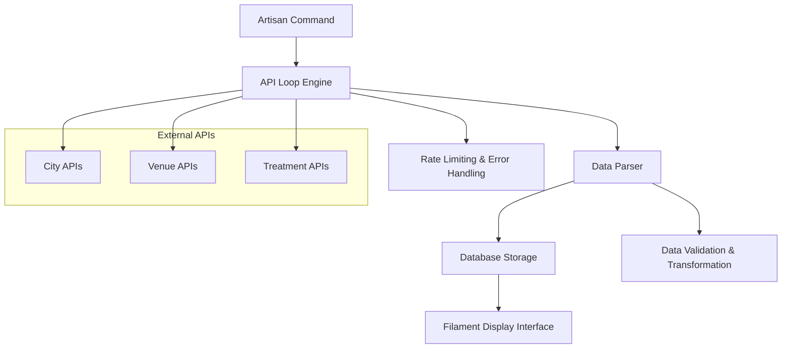

# Design Document

## Overview

The City Data Parser system is a comprehensive solution for collecting, parsing, and displaying venue and treatment information from all cities via API loops. The system consists of two main components: a robust parsing engine that collects maximum information from external APIs, and a clean display interface built with Filament v4.3 that presents the parsed data without administrative functionality.

The system leverages the existing Laravel application structure with models for Cities, Venues, Treatments, Locations, and related entities. It extends the current FetchVenuesCommand functionality to provide comprehensive data collection across all cities and implements a new Filament-based interface for data visualization.

## Architecture

### High-Level Architecture



### Component Architecture

The system follows a layered architecture pattern:

1. **Command Layer**: Artisan commands for orchestrating data collection
2. **Service Layer**: Business logic for API interaction and data processing
3. **Repository Layer**: Data access and persistence logic
4. **Presentation Layer**: Filament resources for data display
5. **Infrastructure Layer**: External API clients and utilities

## Components and Interfaces

### 1. Enhanced Parsing Command

**Class**: `App\Console\Commands\ParseAllCitiesCommand`

Extends the existing FetchVenuesCommand functionality to provide comprehensive city data parsing:

```php
interface CityDataParserInterface
{
    public function parseAllCities(array $options = []): ParseResult;
    public function parseCityData(string $citySlug): CityParseResult;
    public function resumeFromLastCity(): ParseResult;
    public function generateProgressReport(): ProgressReport;
}
```

### 2. API Loop Engine

**Class**: `App\Services\ApiLoopEngine`

Manages the iteration through cities and API endpoints:

```php
interface ApiLoopEngineInterface
{
    public function getAllCities(): Collection;
    public function getApiEndpointsForCity(string $citySlug): array;
    public function processApiEndpoint(string $endpoint, array $options = []): ApiResponse;
    public function handleRateLimit(int $retryAfter): void;
    public function handleApiError(ApiException $exception): void;
}
```

### 3. Data Processing Service

**Class**: `App\Services\CityDataProcessor`

Handles data transformation and validation:

```php
interface DataProcessorInterface
{
    public function processVenueData(array $rawData): ProcessedVenue;
    public function processTreatmentData(array $rawData): ProcessedTreatment;
    public function processLocationData(array $rawData): ProcessedLocation;
    public function validateDataIntegrity(array $data): ValidationResult;
    public function transformApiResponse(array $response): TransformedData;
}
```

### 4. Filament Display Resources

**Classes**: 
- `App\Filament\Resources\VenueResource`
- `App\Filament\Resources\CityResource`
- `App\Filament\Resources\TreatmentResource`

Filament resources for displaying parsed data:

```php
interface DisplayResourceInterface
{
    public function getTableColumns(): array;
    public function getFilters(): array;
    public function getSearchableColumns(): array;
    public function getDefaultSort(): array;
}
```

### 5. Progress Tracking System

**Class**: `App\Services\ProgressTracker`

Tracks parsing progress and provides resumability:

```php
interface ProgressTrackerInterface
{
    public function markCityAsStarted(string $citySlug): void;
    public function markCityAsCompleted(string $citySlug, array $stats): void;
    public function markCityAsFailed(string $citySlug, string $error): void;
    public function getLastProcessedCity(): ?string;
    public function getOverallProgress(): ProgressSummary;
}
```

## Data Models

### Enhanced Existing Models

The system leverages and enhances existing models:

#### City Model Extensions
```php
// Additional methods for parsing
public function getApiEndpoints(): array;
public function getParsingStatus(): string;
public function markAsProcessed(): void;
public function getVenueCount(): int;
public function getTreatmentCount(): int;
```

#### Venue Model Extensions
```php
// Additional parsing metadata
public function getParsingMetadata(): array;
public function updateFromApiData(array $data): void;
public function getDataCompleteness(): float;
```

#### New Models

**ParseProgress Model**
```php
class ParseProgress extends Model
{
    protected $fillable = [
        'city_slug',
        'status', // 'pending', 'processing', 'completed', 'failed'
        'started_at',
        'completed_at',
        'venues_found',
        'treatments_found',
        'api_calls_made',
        'error_message',
        'metadata'
    ];
}
```

**ApiCallLog Model**
```php
class ApiCallLog extends Model
{
    protected $fillable = [
        'endpoint',
        'city_slug',
        'status_code',
        'response_time',
        'data_points_extracted',
        'error_message',
        'called_at'
    ];
}
```

## Correctness Properties

*A property is a characteristic or behavior that should hold true across all valid executions of a system-essentially, a formal statement about what the system should do. Properties serve as the bridge between human-readable specifications and machine-verifiable correctness guarantees.*

### Property Reflection

After analyzing all acceptance criteria, I identified several properties that can be consolidated to eliminate redundancy:

- Properties 4.1-4.5 (comprehensive data collection) can be combined into a single property about complete data collection
- Properties 3.1-3.3 (data format handling) can be combined into a single adaptability property
- Properties 2.2-2.4 (display functionality) can be combined into a single interface completeness property

### Core Properties

**Property 1: Complete city processing**
*For any* set of cities in the system, when the parsing command is executed, all cities should be processed and marked as completed
**Validates: Requirements 1.1**

**Property 2: Comprehensive data collection**
*For any* city processed by the parser, all expected data types (venues, treatments, services, ratings, locations) should be collected and stored
**Validates: Requirements 1.2, 4.1, 4.2, 4.3, 4.4, 4.5**

**Property 3: Graceful error handling**
*For any* API failure or rate limiting scenario, the parser should continue processing other cities and log appropriate error information
**Validates: Requirements 1.3, 3.4**

**Property 4: Data persistence completeness**
*For any* data collected from APIs, all information should be properly stored in the database with correct relationships
**Validates: Requirements 1.4, 3.5**

**Property 5: Progress reporting accuracy**
*For any* parsing session, the system should generate a summary containing accurate statistics about processed cities, collected data, and encountered errors
**Validates: Requirements 1.5, 5.5**

**Property 6: Interface data completeness**
*For any* parsed city data, the display interface should show all collected fields and attributes without requiring authentication
**Validates: Requirements 2.1, 2.4**

**Property 7: Interface functionality**
*For any* data set displayed in the interface, search, filtering, and sorting operations should work correctly and return expected results
**Validates: Requirements 2.2, 2.3**

**Property 8: Data freshness**
*For any* updated city data, the display interface should reflect the latest parsed information
**Validates: Requirements 2.5**

**Property 9: Format adaptability**
*For any* data format encountered (JSON, XML, nested structures), the parser should successfully extract and store the information
**Validates: Requirements 3.1, 3.2, 3.3**

**Property 10: Resumability**
*For any* interrupted parsing session, restarting the parser should continue from the last successfully processed city
**Validates: Requirements 5.1**

**Property 11: Memory efficiency**
*For any* large dataset, the parser should use chunking and batch processing to maintain stable memory usage
**Validates: Requirements 5.2**

**Property 12: Rate limiting compliance**
*For any* API rate limiting scenario, the parser should implement exponential backoff and retry mechanisms
**Validates: Requirements 5.3**

**Property 13: Deduplication consistency**
*For any* duplicate data encountered, the parser should update existing records rather than creating duplicates
**Validates: Requirements 5.4**

<function_calls>
<invoke name="prework">
<parameter name="featureName">city-data-parser

## Error Handling

### API Error Handling Strategy

1. **Rate Limiting**: Implement exponential backoff with jitter
   - Initial delay: 1 second
   - Maximum delay: 300 seconds (5 minutes)
   - Backoff multiplier: 2.0
   - Jitter: ±25% random variation

2. **Connection Errors**: Retry with circuit breaker pattern
   - Maximum retries: 3 attempts
   - Circuit breaker threshold: 5 consecutive failures
   - Circuit breaker timeout: 60 seconds

3. **Data Validation Errors**: Log and continue processing
   - Invalid data logged with context
   - Processing continues with valid data
   - Summary includes validation error counts

4. **Memory Management**: Chunked processing with cleanup
   - Process cities in batches of 10
   - Clear memory between batches
   - Monitor memory usage and adjust batch size

### Error Recovery Mechanisms

```php
interface ErrorRecoveryInterface
{
    public function handleApiTimeout(string $endpoint): RecoveryAction;
    public function handleRateLimit(int $retryAfter): RecoveryAction;
    public function handleDataValidationError(array $data, string $error): RecoveryAction;
    public function handleMemoryLimit(): RecoveryAction;
}
```

## Testing Strategy

### Dual Testing Approach

The system requires both unit testing and property-based testing to ensure comprehensive coverage:

#### Unit Testing Requirements

Unit tests will cover:
- Specific API response parsing scenarios
- Error handling edge cases
- Data transformation examples
- Filament resource configuration
- Command option parsing

Unit tests provide concrete examples and catch specific bugs in implementation details.

#### Property-Based Testing Requirements

Property-based tests will verify the correctness properties defined above using **PHPUnit with Eris** as the property-based testing library. Each property-based test will run a minimum of 100 iterations to ensure thorough coverage.

**Property-based test requirements:**
- Each correctness property must be implemented by a SINGLE property-based test
- Each test must be tagged with the format: **Feature: city-data-parser, Property {number}: {property_text}**
- Tests must generate realistic test data including cities, API responses, and database states
- Tests must verify universal properties across all valid inputs

**Example property-based test structure:**
```php
/**
 * Feature: city-data-parser, Property 1: Complete city processing
 * Validates: Requirements 1.1
 */
public function testCompleteCity Processing()
{
    $this->forAll(
        Generator\seq(Generator\elements(['vilnius', 'kaunas', 'klaipeda']))
    )->then(function ($cities) {
        // Test that all cities are processed
        $result = $this->parser->parseAllCities(['cities' => $cities]);
        
        foreach ($cities as $city) {
            $this->assertTrue($result->isCityProcessed($city));
        }
    });
}
```

### Integration Testing

Integration tests will verify:
- End-to-end parsing workflows
- Database transaction integrity
- Filament interface functionality
- Command execution with real database

### Performance Testing

Performance tests will validate:
- Memory usage during large dataset processing
- API rate limiting compliance
- Database query optimization
- Response times for Filament interfaces

## Implementation Architecture

### Service Layer Design

```php
// Main parsing orchestrator
class CityDataParsingService
{
    public function __construct(
        private ApiLoopEngine $apiEngine,
        private DataProcessor $processor,
        private ProgressTracker $tracker,
        private ErrorHandler $errorHandler
    ) {}
    
    public function parseAllCities(array $options = []): ParseResult
    {
        $cities = $this->apiEngine->getAllCities();
        $results = new ParseResult();
        
        foreach ($cities as $city) {
            try {
                $this->tracker->markCityAsStarted($city->slug);
                $cityResult = $this->parseSingleCity($city, $options);
                $this->tracker->markCityAsCompleted($city->slug, $cityResult->getStats());
                $results->addCityResult($cityResult);
            } catch (Exception $e) {
                $this->errorHandler->handleCityError($city, $e);
                $this->tracker->markCityAsFailed($city->slug, $e->getMessage());
            }
        }
        
        return $results;
    }
}
```

### Filament Resource Configuration

Since the user specifically requested Filament v4.3 instead of the existing Backpack CRUD, we'll need to:

1. Install Filament v4.3 alongside the existing Backpack system
2. Create dedicated Filament resources for data display only (no admin functionality)
3. Configure Filament to work without authentication
4. Create custom pages for comprehensive data visualization

```php
// Example Filament resource structure
class VenueResource extends Resource
{
    protected static ?string $model = Venue::class;
    protected static ?string $navigationIcon = 'heroicon-o-building-office';
    protected static bool $shouldRegisterNavigation = true;
    
    public static function table(Table $table): Table
    {
        return $table
            ->columns([
                TextColumn::make('name')->searchable()->sortable(),
                TextColumn::make('city.name')->label('City')->searchable(),
                TextColumn::make('address')->searchable(),
                TextColumn::make('rating')->sortable(),
                TextColumn::make('treatments_count')->counts('treatments'),
            ])
            ->filters([
                SelectFilter::make('city')->relationship('cities', 'name'),
                Filter::make('has_rating')->query(fn ($query) => $query->whereNotNull('rating')),
            ])
            ->defaultSort('name');
    }
    
    // Disable create, edit, delete actions for display-only interface
    public static function getPages(): array
    {
        return [
            'index' => Pages\ListVenues::route('/'),
            'view' => Pages\ViewVenue::route('/{record}'),
        ];
    }
}
```

### Database Schema Enhancements

Additional tables needed for comprehensive parsing:

```sql
-- Progress tracking
CREATE TABLE parse_progress (
    id BIGINT UNSIGNED AUTO_INCREMENT PRIMARY KEY,
    city_slug VARCHAR(255) NOT NULL,
    status ENUM('pending', 'processing', 'completed', 'failed') DEFAULT 'pending',
    started_at TIMESTAMP NULL,
    completed_at TIMESTAMP NULL,
    venues_found INT DEFAULT 0,
    treatments_found INT DEFAULT 0,
    api_calls_made INT DEFAULT 0,
    error_message TEXT NULL,
    metadata JSON NULL,
    created_at TIMESTAMP DEFAULT CURRENT_TIMESTAMP,
    updated_at TIMESTAMP DEFAULT CURRENT_TIMESTAMP ON UPDATE CURRENT_TIMESTAMP,
    INDEX idx_city_slug (city_slug),
    INDEX idx_status (status)
);

-- API call logging
CREATE TABLE api_call_logs (
    id BIGINT UNSIGNED AUTO_INCREMENT PRIMARY KEY,
    endpoint VARCHAR(500) NOT NULL,
    city_slug VARCHAR(255) NULL,
    status_code INT NULL,
    response_time INT NULL, -- milliseconds
    data_points_extracted INT DEFAULT 0,
    error_message TEXT NULL,
    called_at TIMESTAMP DEFAULT CURRENT_TIMESTAMP,
    INDEX idx_endpoint (endpoint(255)),
    INDEX idx_city_slug (city_slug),
    INDEX idx_called_at (called_at)
);
```

## Security Considerations

### Data Access Security

1. **No Authentication Required**: As specified, the Filament interface will not require authentication
2. **Read-Only Access**: All Filament resources configured for viewing only
3. **Rate Limiting**: Implement rate limiting on the display interface to prevent abuse
4. **Data Sanitization**: Ensure all displayed data is properly sanitized

### API Security

1. **API Key Management**: Store API keys securely in environment variables
2. **Request Validation**: Validate all API responses before processing
3. **Error Information**: Avoid exposing sensitive API details in error messages
4. **Audit Logging**: Log all parsing activities for monitoring

## Performance Optimization

### Parsing Performance

1. **Concurrent Processing**: Process multiple cities in parallel where possible
2. **Database Optimization**: Use bulk inserts and updates
3. **Memory Management**: Implement proper garbage collection between batches
4. **Caching**: Cache API responses temporarily to avoid redundant calls

### Display Performance

1. **Database Indexing**: Ensure proper indexes on searchable and sortable columns
2. **Query Optimization**: Use eager loading for relationships
3. **Pagination**: Implement efficient pagination for large datasets
4. **Caching**: Cache frequently accessed data

### Resource Management

```php
class ResourceManager
{
    private int $maxMemoryUsage = 512 * 1024 * 1024; // 512MB
    private int $batchSize = 10;
    
    public function adjustBatchSize(): void
    {
        $currentMemory = memory_get_usage(true);
        
        if ($currentMemory > $this->maxMemoryUsage * 0.8) {
            $this->batchSize = max(1, intval($this->batchSize * 0.7));
        } elseif ($currentMemory < $this->maxMemoryUsage * 0.5) {
            $this->batchSize = min(50, intval($this->batchSize * 1.2));
        }
    }
}
```

## Deployment Considerations

### Environment Setup

1. **Filament Installation**: Install Filament v4.3 alongside existing Backpack
2. **Database Migrations**: Run new migrations for progress tracking
3. **Environment Variables**: Configure API endpoints and keys
4. **Queue Configuration**: Set up queues for background processing

### Monitoring and Maintenance

1. **Progress Monitoring**: Dashboard for tracking parsing progress
2. **Error Alerting**: Notifications for parsing failures
3. **Performance Metrics**: Monitor memory usage and processing times
4. **Data Quality**: Regular checks for data completeness and accuracy

This design provides a comprehensive foundation for implementing the city data parsing system with robust error handling, comprehensive testing, and efficient data display capabilities.